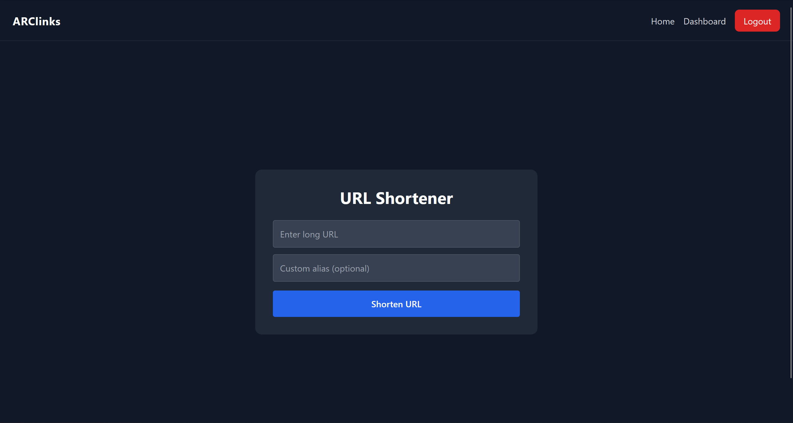
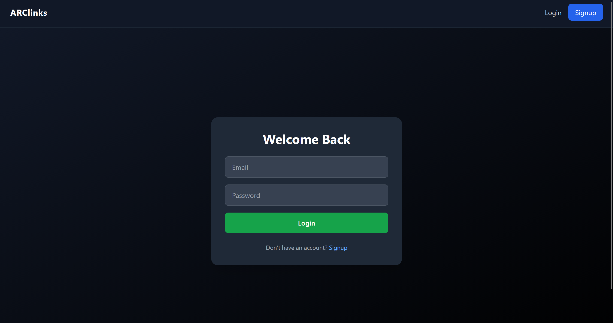
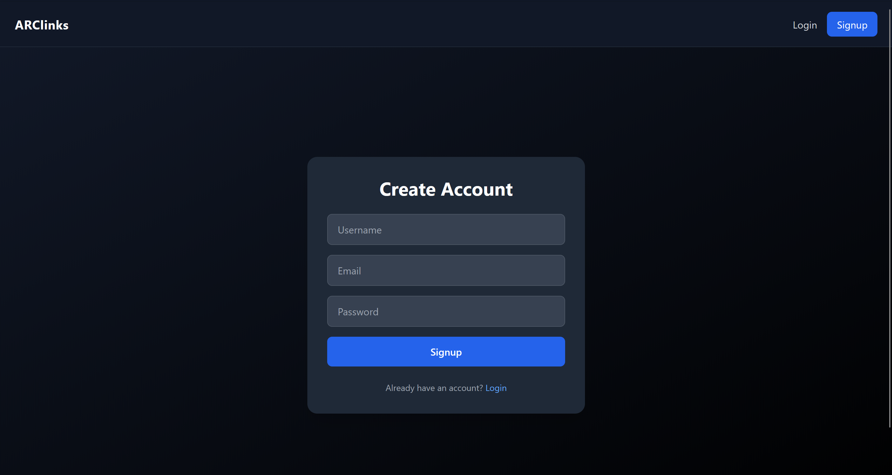
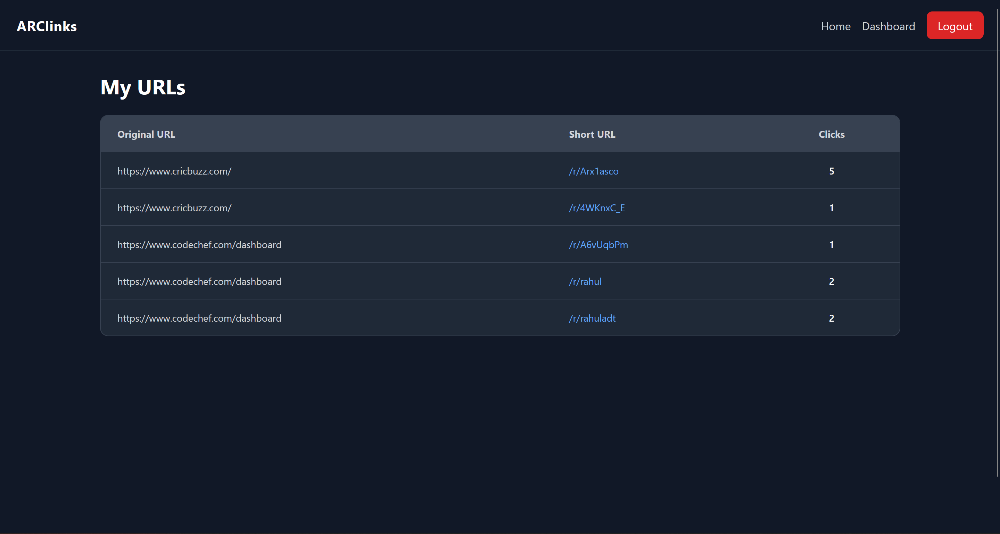

# 🔗 URL Shortener – Full Stack Web Application

A full-stack URL shortener application with **authentication, custom short links, user dashboards, and click analytics**, built using the **MERN stack**.

This project focuses on **secure backend design**, **user ownership**, and a **clean, modern UI**.

---

## ✨ Features

- 🔐 **JWT Authentication**
  - Secure Signup & Login
  - Protected routes using JSON Web Tokens

- 🔗 **URL Shortening**
  - Generate short URLs for long links
  - Automatic redirection to original URL

- ✨ **Custom Short Links**
  - Users can create custom aliases (e.g. `/r/my-link`)
  - Backend validation prevents duplicate aliases

- 👤 **User Dashboard**
  - View all URLs created by the logged-in user
  - URLs are scoped strictly to their owner

- 📊 **Click Analytics**
  - Track number of clicks for each short URL
  - Analytics updated automatically on every redirect

- 🧭 **Authorization & Ownership**
  - Only the creator of a URL can view or manage it
  - Backend enforces ownership using userId from JWT

- 🎨 **Modern UI**
  - Built with React & Tailwind CSS
  - Responsive, clean, dark-themed design

---

## 🛠 Tech Stack

### Frontend
- React
- React Router
- Tailwind CSS

### Backend
- Node.js
- Express.js
- MongoDB (Mongoose)
- JWT for authentication
- bcrypt for password hashing

---

## 🧠 System Design Highlights

- **Stateless authentication** using JWT
- **Authorization middleware** to protect APIs
- **User ownership enforced at database level**
- **RESTful API design**
- **Separation of concerns** (routes, controllers, models)

---

## 📸 Screenshots

### Home Page

### Login Page

### SignUp Page

### Dashboard

